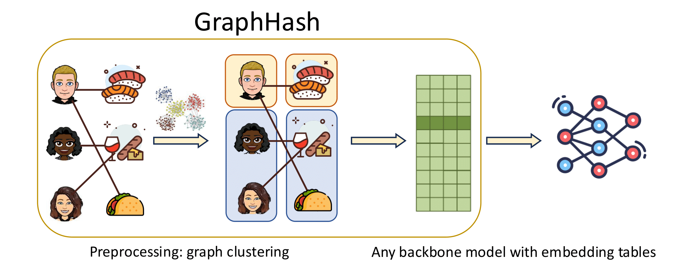

# GraphHash

This is the offical Github repository of GraphHash.

[GraphHash: Graph Clustering Enables Parameter Efficiency in Recommender Systems](https://arxiv.org/abs/2412.17245)

[Xinyi Wu](https://xinyiwu98.github.io/), [Donald Loveland](https://www.donaldloveland.com/), [Runjin Chen](https://chenrunjin.github.io/), [Yozen Liu](https://scholar.google.com/citations?user=i3U2JjEAAAAJ&hl=en), Xin Chen, [Leonardo Neves](https://scholar.google.com/citations?user=cJwZx6IAAAAJ&hl=en), [Ali Jadbabaie](https://jadbabaie.mit.edu/), [Clark Mingxuan Ju](https://jumxglhf.github.io/), [Neil Shah](https://nshah.net/), [Tong Zhao](https://tzhao.io/)

*The ACM Web Conference (WWW) 2025*



------

### Install packages

```python
conda create -n graphhash python=3.9
conda activate graphhash
pip install -r requirements.txt
```

------


### Download data

The processed data can be downloaded from https://drive.google.com/file/d/1vcyDljpxG3-TJdzgbhVdoWIK-eA_wIF-/view?usp=sharing

Make sure the unzipped folder `dataset` is under the same directory as the `train.py` file in this repo.

Detailed notebooks containing preprocessing steps are included.


------

### Run experiments

Example command to run GraphHash for the retrieval task on Gowalla with full batch size:

```python

python train.py model=MF hash_type=graph dataset=Gowalla dataset.lr=1e-2 dataset.wd=1e-8 dataset.loss=BPR

```

All the commands for running our experiments are provided in ```commands.sh```, with the best searched hyperparameters.
Note that the experiments are configured using [hydra](https://hydra.cc/).
Please see its documentation for detailed usage.


------

### Citation
Thank you for your interest in our work!
Please consider citing
```bibtex
@inproceedings{Wu2025GraphHashGC,
  title={GraphHash: Graph Clustering Enables Parameter Efficiency in Recommender Systems},
  author={Xinyi Wu and Donald Loveland and Runjin Chen and Yozen Liu and Xin Chen and Leonardo Neves and Ali Jadbabaie and Clark Mingxuan Ju and Neil Shah and Tong Zhao},
  booktitle={Proceedings of the ACM Web Conference 2025},
  year={2025}
}
```
Please email xinyiwu@mit.edu if you run into any problems.
